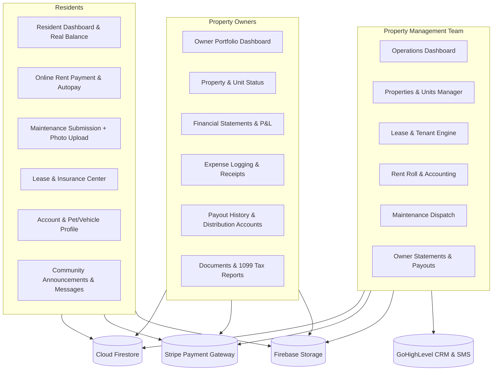

# Property Management Platform Transformation Plan

This document presents a comprehensive audit of the current **Next Level Rentals** codebase and an actionable, phased architectural roadmap to transform it into a legitimate, full-featured property management platform for Property Managers (Admin), Property Owners (Landlords), and Residents (Tenants).

---

## 1. Codebase Audit & Current State Analysis

### 1.1 Architecture & Tech Stack Foundation
- **Frontend**: Next.js 14.2 (Pages Router), React 18.3, TypeScript 5.4 (Strict mode passes with zero errors), CSS custom properties in `styles/globals.css`, and scoped styled-jsx.
- **Backend & Database**: Firebase Cloud Firestore, Firebase Auth (`email/password` with `browserSessionPersistence`), Firebase Storage for file uploads, and Next.js API routes powered by Firebase Admin SDK.
- **External CRM & Communications**: GoHighLevel (GHL) integration (`lib/ghl.ts`, `lib/ghl-sync.ts`) for syncing tenant contacts, payments, maintenance status notes, and outbound notification emails.
- **AI Assistant**: Google Gemini (`@google/generative-ai`) embedded in `components/Chat` ("Nex") capable of function calling into Firestore data.

---

### 1.2 How the App Currently Functions for Tenants
| Feature | Current State | What's Missing / Broken for a Real PM App |
| :--- | :--- | :--- |
| **Authentication & Routing** | Accesses `/portal` protected by `AuthGuard` with role `tenant`. Loads profile from `users/{uid}`. | No tenant invitation or onboarding self-registration flow with temporary token. |
| **Dashboard & Metrics** | `TenantPortal.tsx` renders hero, next due date, days until due, and active maintenance count. | `currentBalance` is **hardcoded to 0** in `usePortalData.ts`. It does not calculate unpaid rent, late fees, or utility charges. |
| **Rent Payments** | Displays payment history table from `payments` collection. | **Online rent payment is completely disabled**: The "Pay Rent" action was filtered out (`filter(a => a.id !== 'qa-pay-rent')`) because Stripe Checkout / ACH has not been implemented. No autopay or payment receipts. |
| **Maintenance Requests** | Form submits title, description, category, and priority to `/api/maintenance/create`, which creates a Firestore ticket and pushes a note to GHL. | Cannot upload photos during submission. No permission-to-enter checkboxes or pet alerts. No ticket activity timeline with technician notes. |
| **Lease & Documents** | `LeaseDocuments.tsx` renders either a single stub link with `downloadUrl: '#'` or mock data from `data/portal.ts`. | Tenants cannot view or download actual signed lease contracts, rules addendums, or renewal notices. |
| **Account & Profile** | `/account` page exists with tabs ("Profile", "Payment Methods", "Notifications"). | **Non-functional UI**: "Edit Profile" and "Add Payment Method" buttons do nothing. Notification checkboxes do not save to `notificationPreferences/{uid}`. |
| **Communications & Resources** | `CommunicationHub`, `ResidentResources`, and `SupportContacts` render static fixtures from `data/portal.ts`. | No real building announcements, no real two-way messaging, no property-specific utility directory. |
| **Renter's Insurance** | None. | Standard PM portals require uploading proof of renter's insurance with expiration dates and policy numbers. |

---

### 1.3 How the App Currently Functions for Landlords & Admins
The codebase currently exhibits an ambiguous split between **"Admin" (Property Manager / Operator)** and **"Landlord" (Property Owner)**:

| Feature | Current State | What's Missing / Broken for a Real PM App |
| :--- | :--- | :--- |
| **Landlord Experience** | Dual routes: `/landlord` and `/portal` (renders `LandlordPortal.tsx`). Shows total properties and potential revenue. | **Severe functional gaps**: Clicking "View Details" on a property runs `alert("We are working on the property detail view.")`. No dedicated navigation sidebar, no unit breakdown, no financial P&L, no expense logging, no payout management, no owner documents. |
| **Property Management** | `/admin/properties` displays property cards synced from GoHighLevel. | **In-app creation is blocked**: `ALLOW_MANUAL_PROPERTY = false` in UI and `/api/admin/create-property.ts`. Clicking "Manage" runs `alert("Property detail page coming soon!")`. No multi-unit support (properties are flat addresses, not buildings with units). No editing or archiving. |
| **Tenant Management** | `/admin/tenants` lists tenants with GHL sync actions and links to `/admin/ledger/[tenantId]`. | No tenant detail page (contact info, emergency contacts, lease history, vehicle/pet records, notes). |
| **Lease Management** | `lib/leases.ts` contains raw Firestore helper functions. | **No UI exists**: Admins cannot create a lease, assign a tenant to a unit, configure payment due days, set security deposits, or manage lease renewals in the application. |
| **Accounting & Rent Tracking** | `/admin/rent-payments` tracks monthly payment status. `/admin/ledger/[tenantId]` displays charges and manual payments (cash/check). | Financial dashboard mixes real stats with **randomly generated fake trend data** (`Math.random()`). No automated 1st-of-the-month rent charging, no late fee automation, no owner distribution calculations. |
| **Maintenance Triage** | `/admin/maintenance` allows filtering by status and updating status/notes via `MaintenanceStatusModal`. | No vendor / contractor assignment, no scheduling dates, no cost/invoice tracking tied to property expenses. |

---

## 2. Target Platform Architecture

A complete property management platform serves **three distinct personas** with tailored workflows:

---

## 3. Detailed Phased Implementation Plan

### Phase 1: Foundational Domain Models & Role Navigation System
> **Goal**: Unify the navigation shell, clean up role routing, and expand Firestore schema to support real property management.

1. **Role Routing & Layout Clarification**:
   - Establish dedicated shells:
     - `AdminLayout` for `admin` and `super-admin` (`/admin/*`)
     - `LandlordLayout` with modern sidebar navigation for `landlord` (`/landlord/*`)
     - `ResidentLayout` / clean portal shell for `tenant` (`/portal/*`)
   - Route `/portal` intelligently: if `role === 'landlord'`, redirect to `/landlord`; if `role === 'tenant'`, render Resident Portal.
2. **Schema & Types Expansion** (`types/schema.ts`):
   - **Properties & Units**: Support multi-unit hierarchy (`properties/{propertyId}/units/{unitId}`) or unit-aware properties with beds, baths, sqft, target rent, market status (`vacant`, `occupied`, `maintenance`, `listed`), and owner association (`landlordId`).
   - **Leases**: Enhance `Lease` model to support security deposit held, late fee rules (grace period days, fee amount), rent due day, co-signers, and attached lease PDF documents.
   - **Ledger & Real Balance**: Structure ledger entries so tenant current balance is derived as:
     $$\text{Balance} = \sum (\text{charges} + \text{late\_fees} + \text{utilities}) - \sum (\text{payments} + \text{credits})$$
   - **Work Orders**: Add fields for contractor assignment (`assignedVendorName`, `assignedVendorPhone`), tenant permission to enter (`permissionToEnter: boolean`), pet alert, estimated cost, and actual cost.
   - **Renter's Insurance**: Model `RentersInsurance` (`tenantId`, `provider`, `policyNumber`, `effectiveDate`, `expirationDate`, `documentUrl`, `status: 'valid' | 'expired' | 'pending'`).

---

### Phase 2: Landlord & Property Owner Portal
> **Goal**: Provide property owners with a high-trust, professional portal to monitor their assets, financial yields, expenses, and owner disbursements.

1. **Landlord Layout & Navigation** (`components/Landlord/LandlordLayout.tsx`):
   - Sidebar navigation:
     - **Overview** (`/landlord`): Portfolio KPI cards (Total Units, Occupancy %, Gross Billed, Collected, Operating Expenses, Net Cash Flow).
     - **My Properties** (`/landlord/properties`): Grid & list view of owned properties with active lease indicators and unit statuses.
     - **Financials & P&L** (`/landlord/financials`): Monthly Income Statement (Gross Rent, Management Fees, Maintenance Deductions, Net Operating Income).
     - **Expenses & Invoices** (`/landlord/expenses`): Log new expense with receipt upload (plumbing repair, landscaping, property tax, insurance).
     - **Disbursements & Payouts** (`/landlord/payouts`): View distribution schedule, status, and bank account settings.
     - **Maintenance Oversight** (`/landlord/maintenance`): View open and completed work orders for their units with contractor notes and invoice costs.
     - **Documents** (`/landlord/documents`): Download management agreement, insurance certificates, and annual 1099 tax summaries.
2. **Property Detail View for Landlords & Admins** (`pages/admin/properties/[id].tsx` and `/landlord/properties/[id].tsx`):
   - Replace the `alert("Property detail page coming soon!")` with a comprehensive Property Profile:
     - Photo gallery with full-screen viewer.
     - Property specs: Address, year built, sqft, amenities.
     - Active Leases & Current Tenants table with quick ledger links.
     - Maintenance history tab for this specific property.
     - Property-specific financial breakdown (income vs expenses).

---

### Phase 3: Administrative Operations Suite
> **Goal**: Turn the Admin panel into a full operations cockpit allowing property managers to create, edit, lease, and bill without touching raw databases.

1. **Full Property & Unit CRUD**:
   - Re-enable and enhance in-app property creation (`ALLOW_MANUAL_PROPERTY = true` with proper role checks).
   - Add property editing modal / page (update rent, status, description, photos, amenities, assigned owner).
   - Support unit inventory (e.g. Unit 101, Unit 102 under a single building address).
2. **Lease Creation & Management Wizard** (`pages/admin/leases/new.tsx`):
   - Step-by-step wizard to create a lease:
     - Step 1: Select Property & Unit.
     - Step 2: Select or Invite Tenant (name, email, phone).
     - Step 3: Set Lease Terms (start date, end date, monthly rent, security deposit, due day, grace period, late fee).
     - Step 4: Upload Signed Lease Agreement (PDF uploaded directly to Firebase Storage).
     - Step 5: Generate Initial Ledger Charges (Security deposit charge + 1st month prorated/full rent charge).
3. **Tenant 360° Profile** (`pages/admin/tenants/[id].tsx`):
   - Replace the bare table with rich tenant profiles:
     - Contact information, linked GHL contact status, and emergency contacts.
     - Current lease agreement details and renewal timeline.
     - Full financial ledger with balance breakdown, one-click manual payment recording, and fee adjustment.
     - Vehicle registrations (parking pass tracking) and pet details.
     - Direct communication timeline (emails sent, SMS logs, notes).
4. **Maintenance Command Center Enhancement**:
   - Upgrade `/admin/maintenance` with:
     - Vendor assignment modal (select existing vendor or enter contractor info).
     - Schedule maintenance visit (date/time window communicated to tenant).
     - Record contractor invoice / repair cost directly to the property's expense ledger upon ticket resolution.

---

### Phase 4: Modern Tenant / Resident Portal
> **Goal**: Give residents an effortless, beautiful, and self-sufficient portal to pay rent, submit repair requests with photos, track their lease, and manage their living experience.

1. **Real Dynamic Resident Dashboard** (`components/Portal/TenantPortal.tsx`):
   - Replace hardcoded `currentBalance: 0` with real-time Firestore ledger calculation.
   - Prominent billing card showing: Current Balance, Payment Due Date, Breakdown (Rent, Utilities, Late Fees), and high-contrast "Pay Rent" CTA.
   - Active Maintenance tracker card showing live progress of their open tickets.
   - Building announcements banner.
2. **Online Rent Payment Gateway**:
   - Implement online payment modal with instant receipts:
     - Support Credit/Debit Card payments with instant confirmation.
     - Support ACH Direct Debit (0% processing fees for high rent amounts).
     - Autopay enrollment toggle.
     - Immediate receipt generation and downloadable/printable payment receipt.
     - Pushes payment notes and receipts to GoHighLevel CRM.
3. **Enhanced Maintenance Submission Flow**:
   - Upgrade `MaintenanceRequestForm.tsx`:
     - Multi-image upload / URL attachments with image preview and delete buttons.
     - Permission to enter selector: "Permission to enter if resident not home: Yes / No".
     - Pet alert indicator: "Pets on premises".
     - Preferred entry time window (Morning, Afternoon, Any).
   - Upgrade `MaintenanceRequests.tsx` list:
     - Expandable request card showing photo thumbnails, permission badges, scheduled technician date, and real-time status updates.
4. **Lease & Documents Center** (`components/Portal/LeaseDocuments.tsx`):
   - View signed lease details (lease term dates, monthly rent amount, security deposit held, grace period, late fees).
   - One-click secure PDF download of the signed lease agreement.
   - Downloadable building rules, move-in checklist, and tenant handbook.
5. **Renter's Insurance Tracker**:
   - Allow tenant to input insurer name, policy number, and expiration date with upload/update modal.
   - Track verified status and policy coverage.
6. **Functional Account & Profile Management** (`pages/account/index.tsx`):
   - Editable resident profile: Phone number, alternate phone, emergency contact (name, relation, phone).
   - Vehicle registration: Make, model, year, license plate (for parking permit enforcement).
   - Pet information: Type, breed, weight.
   - Working notification preferences: Checkboxes wired to save immediately to `notificationPreferences/{uid}`.
7. **Resident Life & Building Resources**:
   - Building utility setup directory (Electric, Water, Gas, Internet providers with links and phone numbers).
   - Move-in / move-out procedures guide.

---

### Phase 5: Automated Billing, Late Fees & Notifications
> **Goal**: Automate recurring accounting and tenant communications so the platform runs smoothly on autopilot.

1. **Recurring Monthly Rent Generation**:
   - An automated API route / scheduled Cloud Function (`/api/cron/generate-monthly-charges`):
     - Runs on the 1st of every calendar month.
     - Iterates through all active leases.
     - Automatically creates a `charge` entry in `ledger/{id}` for the monthly rent and updates tenant balances.
     - Sends an automated email / push reminder that rent is posted.
2. **Automated Late Fee Assessment**:
   - Scheduled job running on the grace period cutoff date (e.g. 5th of the month).
   - If a tenant has an outstanding balance, automatically generates a `late_fee` ledger entry and notifies the tenant via GHL email/SMS.
3. **Community Announcements Engine**:
   - Create `announcements` collection in Firestore.
   - Admin tool to broadcast building-wide or property-specific notices (e.g., "Water maintenance notice", "Trash pickup holiday schedule").
   - Push and in-app notifications delivered to all affected residents.

---

## 4. User Review Required & Design Decisions

> [!IMPORTANT]
> **Payment Processing Gateway Choice**:
> For online rent payments, standard industry practice is Stripe (Stripe Billing or Stripe Custom Connect for platform fee splits) with ACH bank debit and credit cards.

> [!NOTE]
> **GoHighLevel vs Native Firestore as Source of Truth**:
> Currently, properties and contacts can sync with GoHighLevel. For a legitimate property management app, Firestore serves as the authoritative internal operational database, while syncing two-way with GoHighLevel for marketing, lead capture, and CRM automations. In-app creation and editing of properties and leases is fully enabled.

---

## 5. Verification & Testing Plan

### Automated Verification
- `npm run lint`: Next.js core web vitals and ESLint code hygiene checks.
- `npx tsc --noEmit`: Strict TypeScript compilation across all models, hooks, API routes, and components.
- `npm run build`: Production Next.js build compilation to verify all routes and static generation paths compile without error.

### Manual End-to-End Verification
1. **Tenant Experience**:
   - Log in as tenant -> Verify real calculated balance and next due date display.
   - Submit maintenance request with photo attachment -> Verify ticket appears in tenant list and syncs to Firestore.
   - Update emergency contact & vehicles in `/account` -> Verify changes persist to Firestore user profile.
   - View Lease Agreement -> Verify signed document opens from Firebase Storage.
2. **Landlord Experience**:
   - Log in as landlord -> Navigate to `/landlord` -> Check portfolio KPIs (units, occupancy, revenue).
   - View property list -> Open property detail view -> Check active lease and maintenance tickets.
   - Log an expense with receipt upload -> Check that expense reflects on the property's P&L statement.
3. **Admin Experience**:
   - Log in as admin -> Create/edit property in-app -> Verify it displays in properties directory.
   - Create a lease -> Link tenant to unit -> Verify initial ledger charge is created.
   - Record manual payment (cash/check) -> Verify ledger balances recalculate instantly.
   - Triage maintenance request -> Assign contractor and update status -> Verify tenant receives update.
